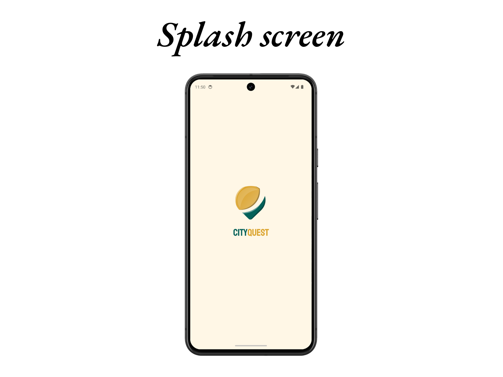
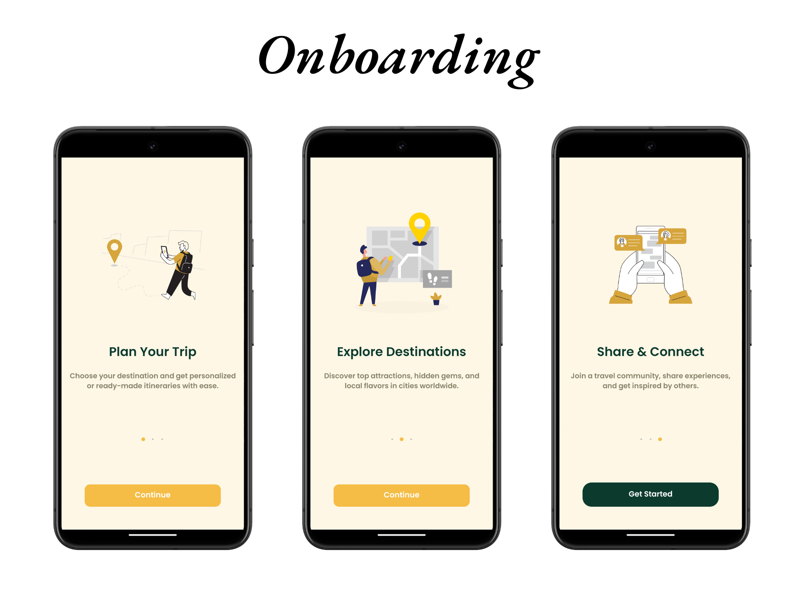
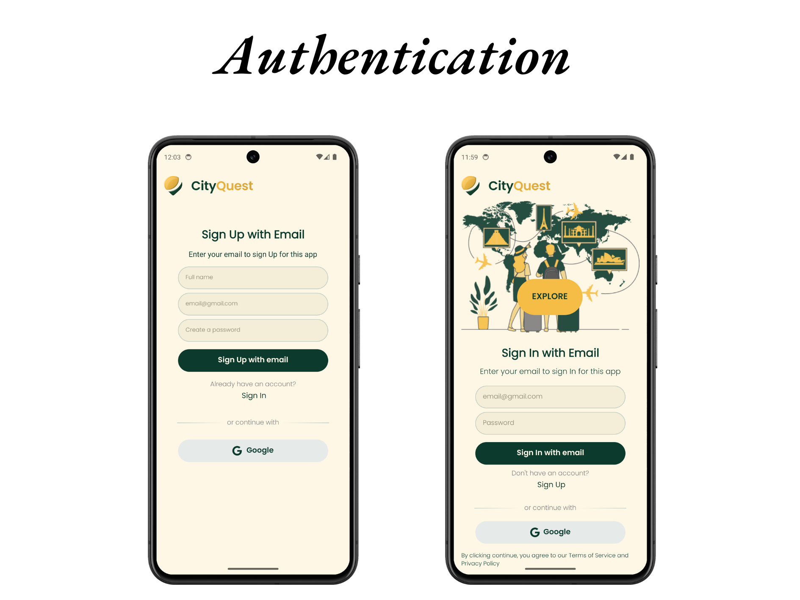
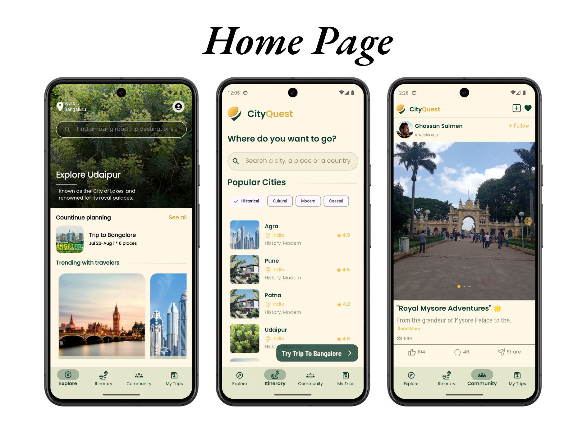
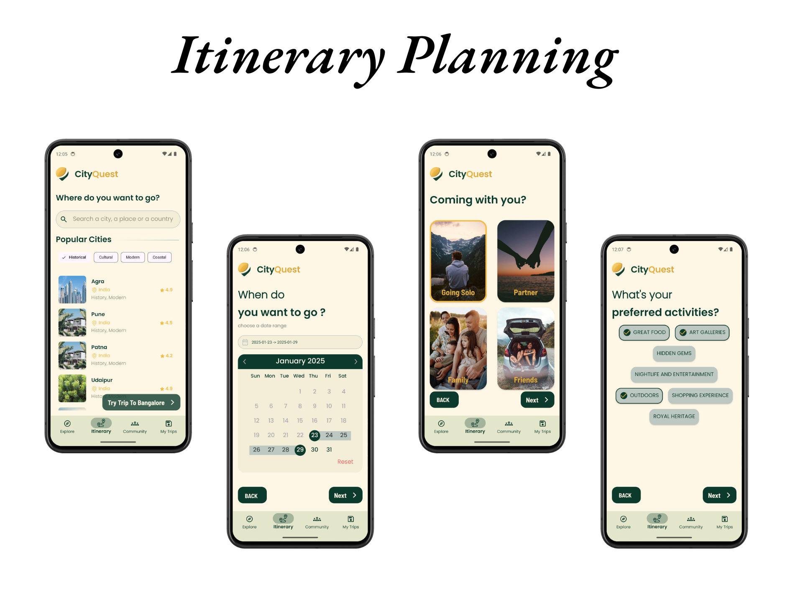
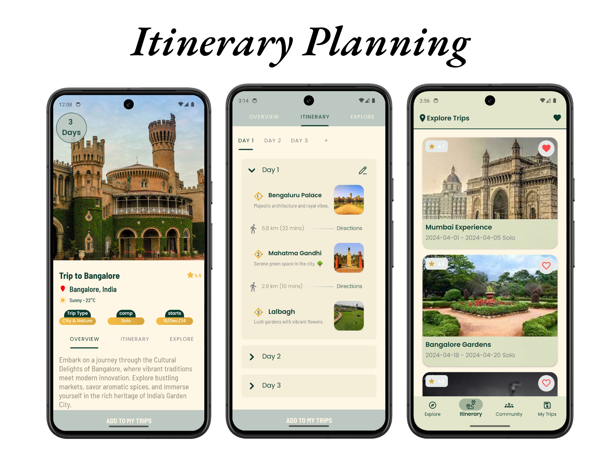
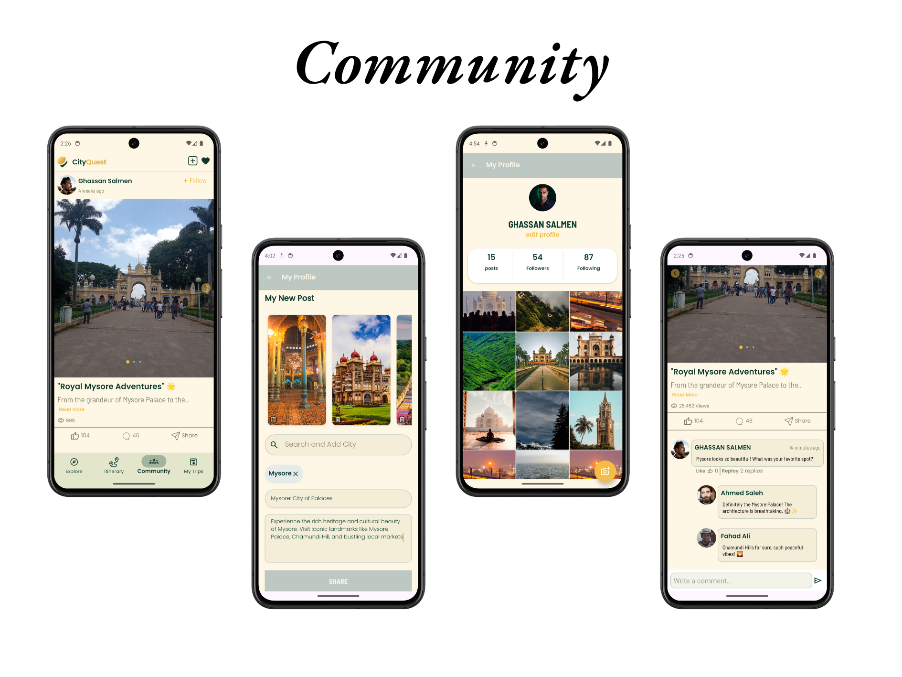

# **CityQuest App** 🌟📱 *Trip Planner*

Welcome to **CityQuest**! 🎉🌍 This ultimate trip-planning app empowers you to explore destinations, plan itineraries, connect with a vibrant travel community, and manage your trips seamlessly. With its sleek design and user-friendly features, **CityQuest** makes travel planning an exciting and personalized experience. ✈️✨

---

## **🌟 Features 🌟**

### 1. **Splash Screen** 🌟  
 

Kickstart your journey with our elegant and welcoming splash screen. 🚀✨  

---

### 2. **Onboarding 🎉📲**  
  

Start your adventure with an engaging onboarding experience! 🎈📝  

- **Welcome Screen:** A warm introduction to **CityQuest** and its features. 🏠🎉  
- **Feature Highlights:** Learn how to explore cities, plan trips, and connect with fellow travelers. 🌍✨  
- **Interactive Navigation:** Get acquainted with our intuitive interface. 🕹️📱  

---

### 3. **Authentication 🔒**  
  

Stay secure with our robust authentication system! 🛡️  

- **Sign Up and Login:** Create an account or log in using Firebase Authentication. 🔑👤  
- **Google Login:** Quickly sign in with your Google account for a seamless experience. 🌐✨  
- **Password Recovery:** Reset your password with ease. 🔄🔐  

---

### 4. **Home Page Sections 🏙️**


Explore four exciting sections to make the most of your travel planning journey. 🌟

- **Explore:** Search and discover different cities. Click on a city to explore its top attractions, nature spots, food, and more. 🗺️✨
- **Itinerary:** Answer a few questions (destination, date range, companions, interests) to get custom trips or view ready-made itineraries. Customize your plans further to suit your preferences. 🗓️📍
- **Community:** Share your travel stories and photos, and explore trips shared by other users. Connect and get inspired! 🌍📸
- **My Trips:** Access and manage your saved trips, including viewing detailed itineraries and editing plans. 🗂️✏️

---

### 5. **Itinerary Planning 🗓️🗺️**

  

Effortlessly plan your trips with our itinerary feature. ✨

- **Trip Questionnaire:** Answer a few questions about your destination, travel dates, companions, and interests. 🚀📋
- **Custom and Ready-Made Plans:** Get tailored trip plans or explore pre-designed itineraries. 🌟
- **Edit Your Trip:** Modify, delete, or reorder the list of places for each day of your trip. 🖋️✅

---

### 6. **Community Page 🌍🤝**  
  

Connect with a vibrant community of travelers! 🌐

- **Share Trips:** Post your travel experiences, photos, and tips. 📸✨
- **Discover Trips:** Get inspired by browsing other users' shared trips. 🌍📖
- **Engage:** Like, comment, and connect with fellow adventurers. 💬🤝

---

## **📬 Contact Us 📬**  

Have questions or need assistance? We’re here to help! 🤗💬  

- **Email:** ghassansalmeen7@gmail.com 📧  
- **LinkedIn:** [@Ghassan Salmeen](https://www.linkedin.com/in/ghassan-muneef-saeed-salmen-779202333/) 🐦  
- **WhatsApp:** [Contact us on WhatsApp](https://wa.me/+917619699362) 📱  

---

### **🌟 Thank you for choosing CityQuest! 🌟**  

We hope CityQuest makes your travel planning effortless and exciting. Share your feedback to help us improve! ✨💬
```
